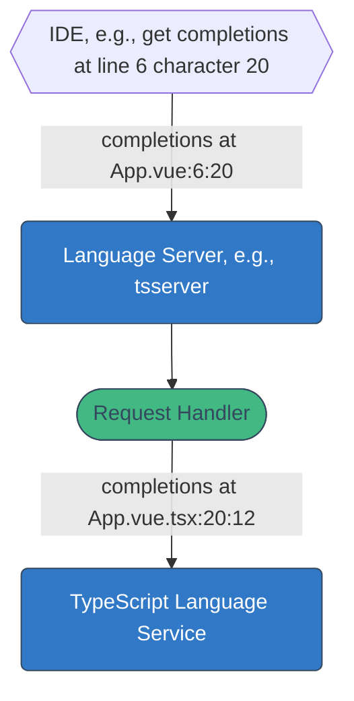
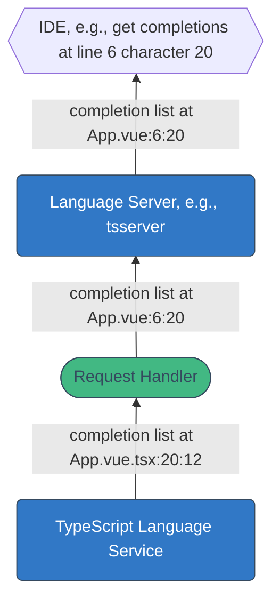
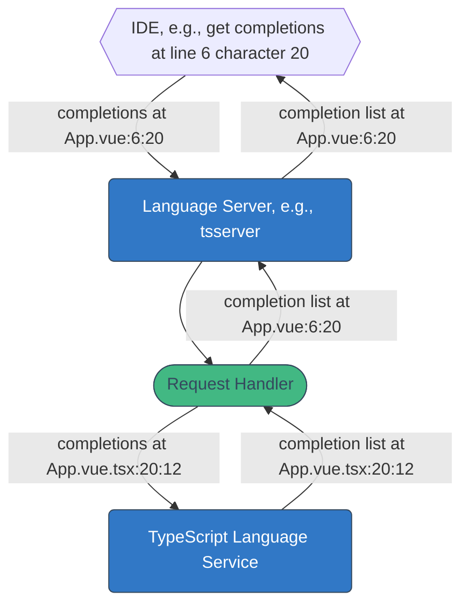

---
# try also 'default' to start simple
# theme: seriph
theme: default
class: 'text-center'
highlighter: shiki
lineNumbers: false
info: |
  ## 
  Presentation slides for developers.
drawings:
  persist: false
colorSchema: light
canvasWidth: 800
css: unocss
---

# TypeScript and Vue

<!--
- Ask some questions?
- Let's talk about "TypeScript & Vue"
-->

---
layout: two-cols
clicks: 1
---

# Rahul Kadyan

- 🕸️ [znck.me](https://znck.me)
- 🐙 [znck](https://github.com/znck)
- 🐥 [@znck0](https://twitter.com/znck0)
- 🧑🏾‍💻 Software Engineer
-  Grammarly


<v-click>

[Grammarly for Developers](https://developer.grammarly.com)

</v-click>

::right::

<v-click at="1">


</v-click>

<!--
- We specialize in interrupting your Youtube videos.
- writing assistance tech
- SDK for webapp
-->

---

## What is TypeScript?

<br>

<v-clicks>

```js
let name = 'Rahul'
```

```ts
let name: string = 'Rahul'
```

`: string` is TypeScript

</v-clicks>


<!-- 
- TS is JS
- And a bit more
- Any JS is TS
- name is string
- check all instances
-->

---
layout: two-cols
---
# Why TypeScript?

<v-clicks>

- Safety at scale
- Empowers developer
- Encourages contribution

</v-clicks>

<!-- 
- grow, users ask features, we ship
- single change, ripple
- verify every part works

<br>

- remember or guess
- references, definition, rename

<br>

- cross hurdle
- type info, ide support
- easy to understand context or purpose
- focused contribution

-->

---

# TypeScript Ecosystem

<v-clicks>

- `typescript` package
  - [Compiler](https://github.com/microsoft/TypeScript/wiki/Using-the-Compiler-API) or `tsc`
  - [Language Service](https://github.com/Microsoft/TypeScript/wiki/Using-the-Language-Service-API)
  - [Language Server](https://github.com/microsoft/TypeScript/wiki/Standalone-Server-%28tsserver%29) or `tsserver`
- IDE integrations
  - VS Code — "TypeScript Language Features"
  - Built using `tsserver`

</v-clicks>

<!-- 
- convinced you
- makes so good

- single package
- what is TS written in?
-->

---
layout: cover
---

# Where does <span class="vue">Vue</span> fit in <span class="ts">TypeScript</span> ecosystem?

<v-click>

JSX is XML-like syntax in JavaScript.

</v-click>

<!--
- more like HTML
- no support

<br>

- jsx

<br>

- main hurdles of TS support
-->

---
layout: two-cols
---

# Module Boundaries

```ts
// @filename: app.ts
import {createApp} from "vue"
import App from "./App.vue"

createApp(App)
```

::right::

<v-click>

# Custom Syntax

```vue
<!-- @filename: App.vue -->
<script setup lang="ts">
import { ref } from 'vue'
const name = ref('Rahul') 
</script>

<template>
  <h1>Hello {{name}}</h1>
</template>
```

</v-click>

<!-- 
- TS needs to understand
- plain old JS module

<br>

- template is JS
- named exports in script
- custom blocks

-->

---
layout: two-cols
---

<br>


::right::

# Volar

<v-clicks>

- *Custom Syntax*: Language Server
- *Module Boundaries*: Take Over Mode
- Limitations:
  - Disables built-in TypeScript extension

</v-clicks>

<!--
- one typescript extension

<br>

- 
-->

---
layout: two-cols
---

<br>


::right::

# VueDX

<v-clicks>

- *Custom Syntax*: TypeScript Plugin
- *Module Boundaries*: TypeScript Plugin
- Limitations:
  - Needs TypeScript extension with plugin support
  - Limited to TypeScript plugin API


</v-clicks>

<!--
- builds on TS ext

<br>
-->

---
layout: center
---

# Setup IDE

<v-clicks>

- [Volar](https://marketplace.visualstudio.com/items?itemName=Vue.volar) — *Officially recommended*
- [VueDX](https://marketplace.visualstudio.com/items?itemName=znck.vue-language-features) — *Personally recommended*
- [Vetur](https://marketplace.visualstudio.com/items?itemName=octref.vetur) — *For Vue 2.x, when Volar does not work*

</v-clicks>

<style>
  em {
    opacity: 0.5;
  }
</style>

<!-- 
- Assuming VS Code, you should

<br>

- find and install

<br>

- still works
-->

---
layout: center
---

# Using TypeScript

---
layout: center
---

# In a new project 

<v-clicks>

- [Vite](https://vitejs.dev/)
- [create-vue](https://github.com/vuejs/create-vue)
- [Nuxt](https://v3.nuxtjs.org/)  
- Vue CLI  **_&larr; (DO NOT USE)_**

</v-clicks>

<style>
  strong {
    color: red;
  }
</style>

<!--
- couple of choice
-->

---
layout: two-cols
---

# New Vite Project

<v-clicks>

```bash
npm create vue@3 my-app
```

```jsonc
// @filename: tsconfig.json
{
  "extends": 
    "@vue/tsconfig/tsconfig.web.json",
  "include": ["src/"],
  "compilerOptions": {
    "baseUrl": ".",
    "paths": {
      "@/*": ["./src/*"]
    }
  },
}
```

</v-clicks>

::right::

<v-clicks>

```vue
<!-- @filename: App.vue -->
<script setup lang="ts">
import { ref } from 'vue'
const tasks = ref([])
const input = ref('')
function add() {
  tasks.value.push(input.value)
}
</script>

<template>
  <input v-model="input" />
  <button @click="add">Add</button>
  <ul>
    <li v-for="task of tasks">
      {{ task }}
    </li>
  </ul>
</template>
```

</v-clicks>

<!--
- create-vue
- prompt, TS
<br>
- cliche
- focus on script
-->

---
layout: two-cols
---

# New Vite Project


```bash
npm create vue@3 my-app
```

```jsonc
// @filename: tsconfig.json
{
  "extends": 
    "@vue/tsconfig/tsconfig.web.json",
  "include": ["src/"],
  "compilerOptions": {
    "baseUrl": ".",
    "paths": {
      "@/*": ["./src/*"]
    }
  },
}
```


::right::


```vue {3-8}
<!-- @filename: App.vue -->
<script setup lang="ts">
import { ref } from 'vue'
const tasks = ref([])
const input = ref('')
function add() {
  tasks.value.push(input.value)
}
</script>

<template>
  <input v-model="input" />
  <button @click="add">Add</button>
  <ul>
    <li v-for="task of tasks">
      {{ task }}
    </li>
  </ul>
</template>
```

<!--
- ... (explain) ...
- TS has issues
-->

---
layout: two-cols
---


```ts twoslash
// @strict
// @errors: 2345
declare module "vue" {
  export interface Ref<T> { value: T }
  export function ref<T>(value: T): Ref<T>
}
// ---cut---
import { ref } from 'vue'
const tasks = ref([])
const input = ref('')
function add() {
  tasks.value.push(input.value)
}
```

::right::

&nbsp;

<!-- 
- (weird voice)
- tell me something useful
-->

---
layout: two-cols
---

```ts twoslash
// @strict
// @errors: 2345
declare module "vue" {
  export interface Ref<T> { value: T }
  export function ref<T>(value: T): Ref<T>
}
// ---cut---
import { ref } from 'vue'
const tasks = ref([])
//    ^?
const input = ref('')
//    ^?
function add() {
  tasks.value.push(input.value)
}
```

::right::

<v-click>

```jsonc
// @filename: tsconfig.json
{
  "compilerOptions": {
    // ...
    "strict": true
  }
}
```

</v-click>

<!--
- explain types
- never
- strict
-->

---
layout: two-cols
---

```ts twoslash {2}
// @strict
declare module "vue" {
  export interface Ref<T> { value: T }
  export function ref<T>(value: T): Ref<T>
}
// ---cut---
import { ref } from 'vue'
const tasks = ref<string[]>([])
//    ^?
const input = ref('')
//    ^?
function add() {
  tasks.value.push(input.value)
}
```

::right::


```jsonc
// @filename: tsconfig.json
{
  "compilerOptions": {
    // ...
    "strict": true
  }
}
```

<!--
- type annotation
- generic function
-->

---
layout: two-cols
---

```ts twoslash
// @strict
// @errors: 2345
declare module "vue" {
  export interface Ref<T> { value: T }
  export function ref<T>(value: T): Ref<T>
}
// ---cut---
import { ref } from 'vue'
const tasks = ref([])
//    ^?
const input = ref('')
//    ^?
function add() {
  tasks.value.push(input.value)
}
```

::right::

```jsonc
// @filename: tsconfig.json
{
  "compilerOptions": {
    // ...
    "strict": true
  }
}
```

<!--
- step back
-->

---
layout: two-cols
---

```ts twoslash
// @strict: false
declare module "vue" {
  export interface Ref<T> { value: T }
  export function ref<T>(value: T): Ref<T>
}
// ---cut---
import { ref } from 'vue'
const tasks = ref([])
//    ^?
const input = ref('')
//    ^?
function add() {
  tasks.value.push(input.value)
}
```

::right::

```jsonc
// @filename: tsconfig.json
{
  "compilerOptions": {
    // ...
    "strict": false
  }
}
```

<!--
- less safe
- push a number
- overwhelming
- cognitive overhead outweighs gain from safety
- BTW, this is all the TypeScript you'll learn today
-->

---
layout: center
---

# Existing Project

<v-clicks>

1. Full migration
2. New code in TypeScript
3. Pockets of type safety

<!--
- old JS project
- add TS, life better
- How?
- Shelve, full
- incrementally
- critical
- one by one
-->

</v-clicks>

---
layout: center
---

# Full Migration

<v-clicks>

- Add `tsconfig.json`  
  - use `"strict": false`
- Update build tools to support TypeScript  
  (e.g. `ts-loader` for webpack)
- Rename all `.js` files to `.ts`
- Add `lang="ts"` to `<script>` block in `.vue`

</v-clicks>

<!--
- new life to old project
- nothing better to do

<br>

- resist vite

<br>
- Blocking — while in migration, no new code
- May be e2e tests
-->

---
layout: center
---

# New code in TypeScript

<v-clicks>

- Add `tsconfig.json`
  - use `"strict": false`
  - use `"allowJs": true`
- Update build tools to support TypeScript  
  (e.g. `ts-loader` for webpack)
- New code should use TypeScript
- (Bonus) Refactor old code to TypeScript

</v-clicks>

<!--
- mention team

<br>

- this is migration of build tools
- positive feedback look
-->

---
layout: center
---

# Pockets of type safety

<v-clicks>

- No `tsconfig.json`
- No need to update build tools
- Use `// @ts-check` to opt-in type checking
- Use JSDoc to define types

</v-clicks>

<!--
- old build system, hard
-->

---


```ts twoslash
// @errors: 2345
// @strict: true
// @filename: define.d.ts
declare module "vue" {
  export interface Ref<T> { value: T }
  export function ref<T>(value: T): Ref<T>
}
export {}
// @filename: index.js
/// <reference types="./define" />
// ---cut---
// @ts-check
import { ref } from 'vue'
const tasks = ref([])
//    ^?
const input = ref('')
function add() {
  tasks.value.push(input.value)
}
```

<!--
- bring old todo app
- trust me it's js
-->

---


```ts twoslash {3}
// @noErrors
// @strict: true
// @filename: define.d.ts
declare module "vue" {
  export interface Ref<T> { value: T }
  export function ref<T>(value: T): Ref<T>
}
export {}
// @filename: index.js
/// <reference types="./define" />
// ---cut---
// @ts-check
import { ref } from 'vue'
/** @type {import('vue').Ref<string[]>} */
const tasks = ref([])
//    ^?
const input = ref('')
function add() {
  tasks.value.push(input.value)
}
```

<!--
- explain @type
-->

---

# JSDoc Reference

https://www.typescriptlang.org/docs/handbook/jsdoc-supported-types.html

<!--
- recent versions of TS
- accessible
- adaptable
-->

---
layout: center
class: text-center
---

# In CI or command line

<p></p>


Volar has `vue-tsc`

<!--
- diagnostics from volar
-->

---
layout: center
class: text-center
---

# In CI or command line

<p></p>


VueDX has `@vuedx/typecheck`


<!--
- If you chose VueDX, thank you
- you got typecheck
-->


---
layout: center
---

# Internals

<!--
- surface, TS to Vue
- lot of work
-->

---


<!--
- disproportionately, few members
- hope to inspire
-->

---
layout: center
class: text-center
---


"Show virtual file" command of VueDX extension

<!--
- JSX representation
- sourcemap
-->

---
layout: center
---



<!--
- just walk through
-->

---
layout: center
---



<!--
- just walk through
-->

---
layout: center
---



<!--
- complexity
- width of features
- config
- coding styles
-->

---
layout: center
---

# That's all

<v-clicks>

- [TypeScript and Vue](https://frontendmasters.com/workshops/typescript-vue/) by Ben Hong | Frontend Masters
- 💖 Support and contribute to [Volar](https://github.com/johnsoncodehk/volar)
- Try [VueDX](https://vuedx.com)
- Checkout [Grammarly for Developers](https://developer.grammarly.com)
- Slides at [github.com/znck/talks](https://github.com/znck/talks/tree/master/2022-11-02-typescript-and-vue)

</v-clicks>

<!--
- thank
-->
